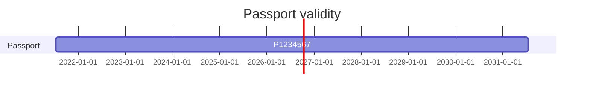

# 10 Identity

Alex holds passport P1234567, valid until 15 Jul 2031. No action is due.

| Document | Number | Issued | Expires | Scan |
| --- | --- | --- | --- | --- |
| Passport | P1234567 | 2021-07-15 | 2031-07-15 | `01 Identity/Passport scan.pdf` |

| Section | Label | Start | End | Source |
| --- | --- | --- | --- | --- |
| Passport | P1234567 | 2021-07-15 | 2031-07-15 | `01 Identity/Passport scan.pdf` |

The 2021 renewal pack is kept whole in `01 Identity/Passport renewal 2021/` (2 files: the scan copy and
`01 Identity/Passport renewal 2021/Application form.docx`, which names the previous passport P0987654).
