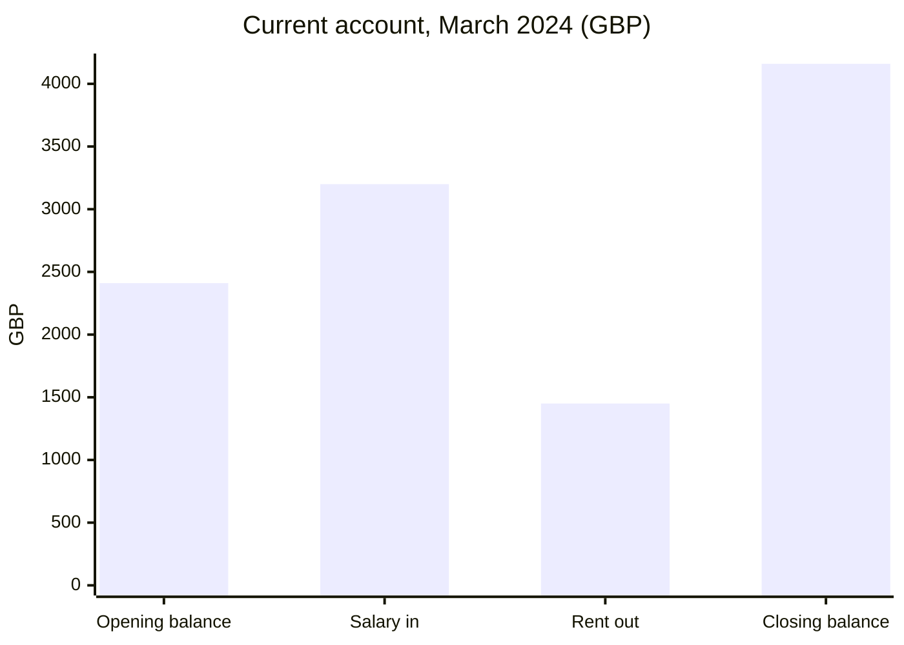

# Bank accounts

One current account at Example Bank plc, number 12345678, sort code 01-02-03 (`02 Finance/Bank statement
2024-03.pdf`; an identical copy sits beside it as `02 Finance/Bank statement 2024-03 (1).pdf`).

| Account | Sort code | Latest statement | Closing balance | Source |
| --- | --- | --- | --- | --- |
| 12345678 | 01-02-03 | March 2024 | GBP 4,160.00 | `02 Finance/Bank statement 2024-03.pdf` |

The March 2024 statement, from opening to closing balance:

| Label | Value (GBP) | Source |
| --- | ---: | --- |
| Opening balance | 2410.00 | `02 Finance/Bank statement 2024-03.pdf` |
| Salary in | 3200.00 | `02 Finance/Bank statement 2024-03.pdf` |
| Rent out | 1450.00 | `02 Finance/Bank statement 2024-03.pdf` |
| Closing balance | 4160.00 | `02 Finance/Bank statement 2024-03.pdf` |
