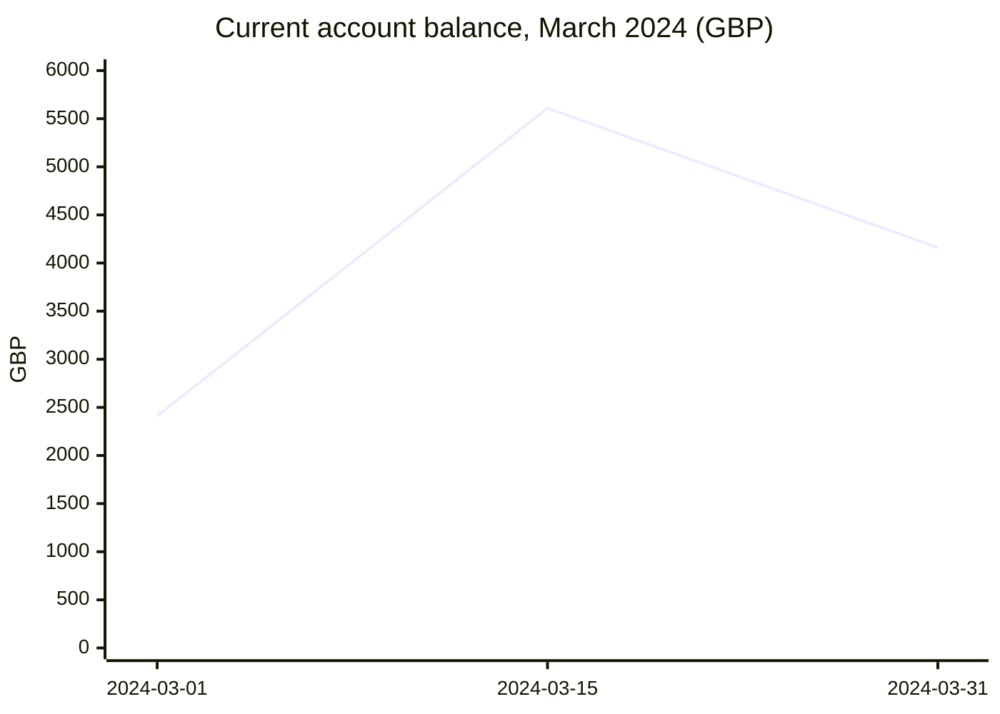
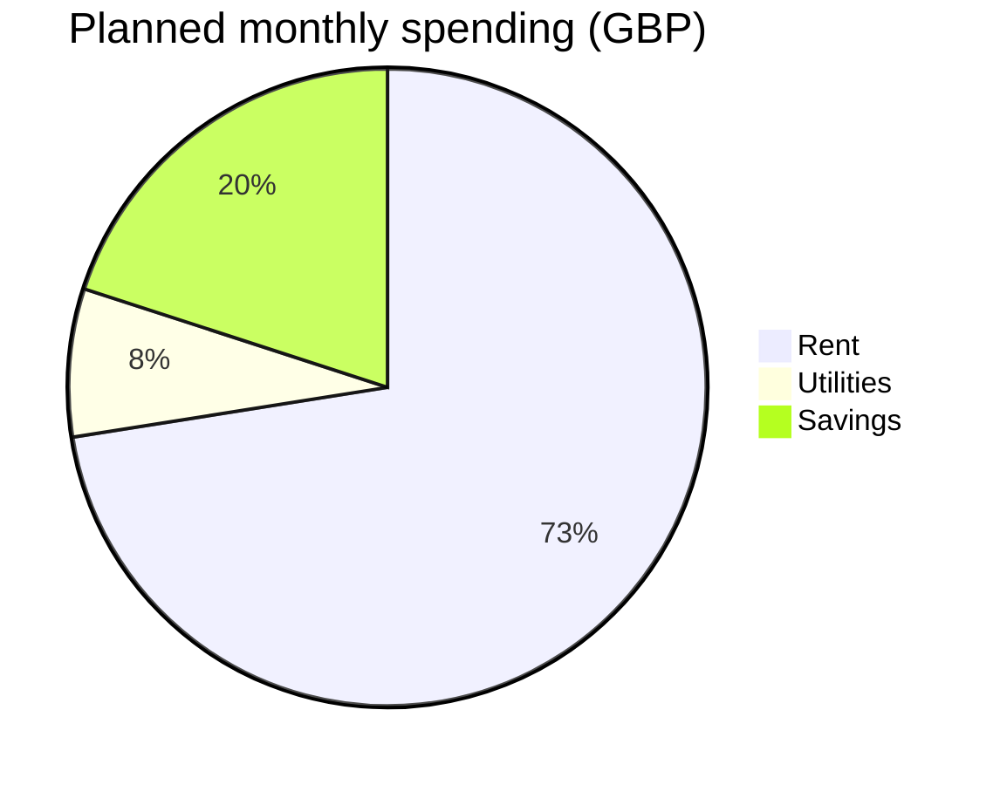

# Cash position

March 2024 closed GBP 1,750 higher than it opened: salary in, rent out.

| Date | Balance (GBP) | Source |
| --- | --- | --- |
| 2024-03-01 | 2410 | `02 Finance/Bank statement 2024-03.pdf` |
| 2024-03-15 | 5610 | `02 Finance/Bank statement 2024-03.pdf` |
| 2024-03-31 | 4160 | `02 Finance/Bank statement 2024-03.pdf` |

Planned monthly spending from `02 Finance/Tax/Budget final.xlsx`:

| Item | GBP per month | Source |
| --- | --- | --- |
| Rent | 1450 | `02 Finance/Tax/Budget final.xlsx` |
| Utilities | 150 | `02 Finance/Tax/Budget final.xlsx` |
| Savings | 400 | `02 Finance/Tax/Budget final.xlsx` |

