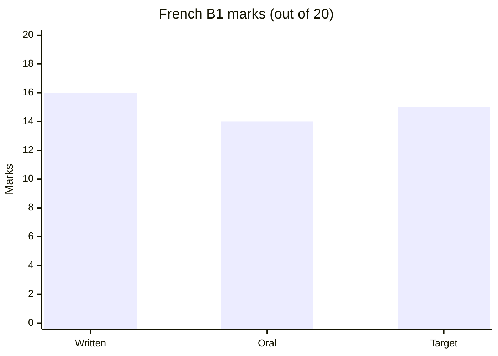

# 40 Study

French to B1 and a Chinese intermediate certificate, 2023 to 2024.

| Course | Result | Path |
| --- | --- | --- |
| French B1 | 16/20 written, 14/20 oral | `04 Study/Cours de français.pdf` |
| Chinese intermediate | excellent | `04 Study/中文课程.pdf` |

| Folder | Files | What it holds |
| --- | --- | --- |
| `04 Study/` | 5 | certificates, slides, essay, notes |
| `05 Archive/` | 4 | copies of the study files |
