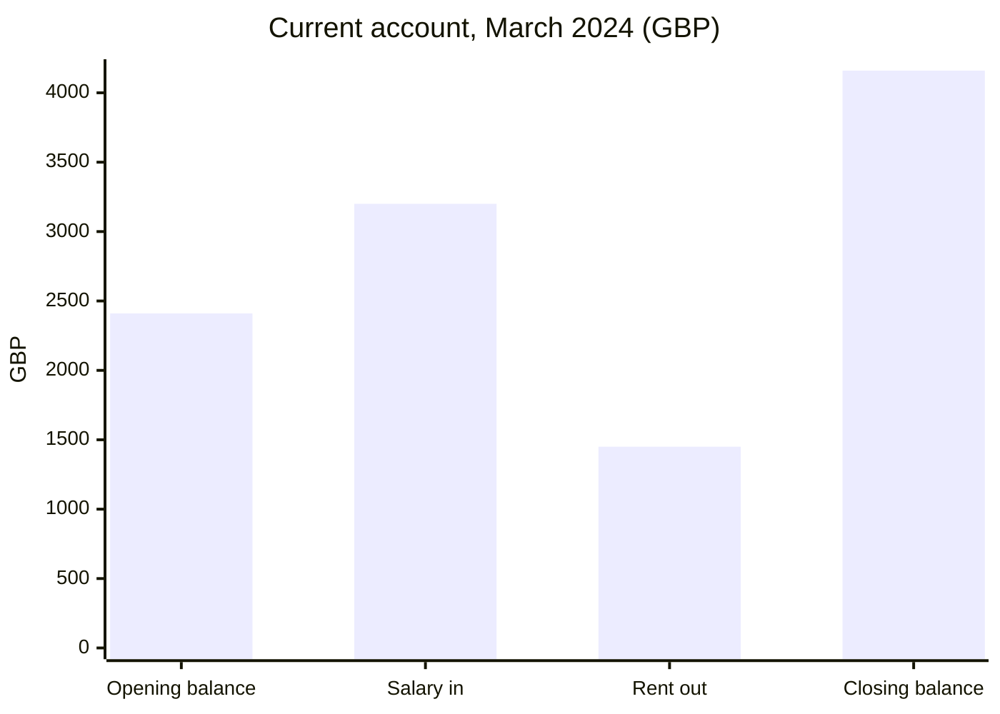

| Label | Value (GBP) | Source |
| --- | ---: | --- |
| Opening balance | 2410.00 | `02 Finance/Bank statement 2024-03.pdf` |
| Salary in | 3200.00 | `02 Finance/Bank statement 2024-03.pdf` |
| Rent out | 1450.00 | `02 Finance/Bank statement 2024-03.pdf` |
| Closing balance | 4160.00 | `02 Finance/Bank statement 2024-03.pdf` |
