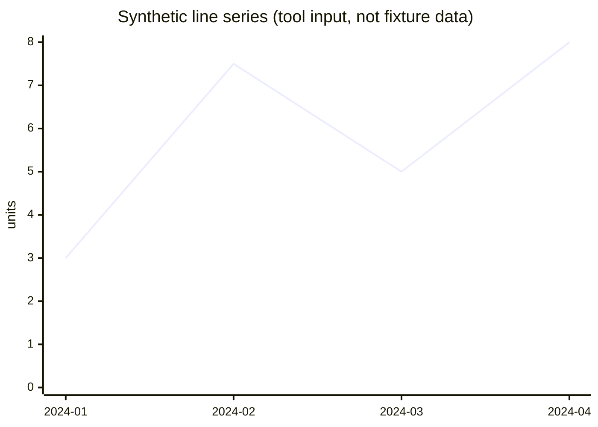

| Period | Value (units) | Source |
| --- | ---: | --- |
| 2024-01 | 3 | `02 Finance/Bank statement 2024-03.pdf` |
| 2024-02 | 7.5 | `02 Finance/Bank statement 2024-03.pdf` |
| 2024-03 | 5 | `02 Finance/Bank statement 2024-03.pdf` |
| 2024-04 | 8 | `02 Finance/Bank statement 2024-03.pdf` |
