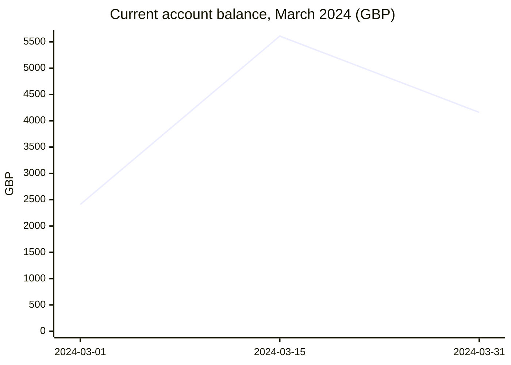

| Period | Value (GBP) | Source |
| --- | ---: | --- |
| 2024-03-01 | 2410 | `02 Finance/Bank statement 2024-03.pdf` |
| 2024-03-15 | 5610 | `02 Finance/Bank statement 2024-03.pdf` |
| 2024-03-31 | 4160 | `02 Finance/Bank statement 2024-03.pdf` |
