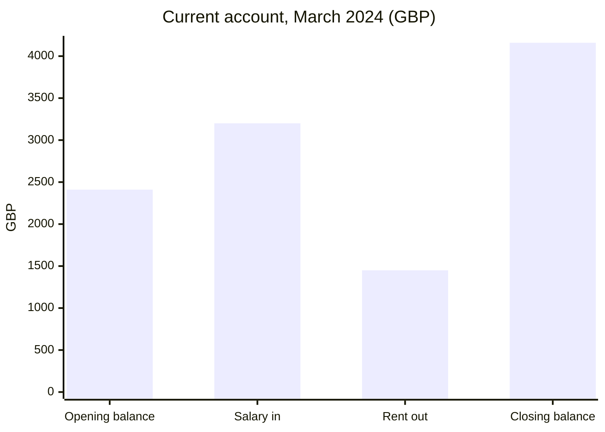
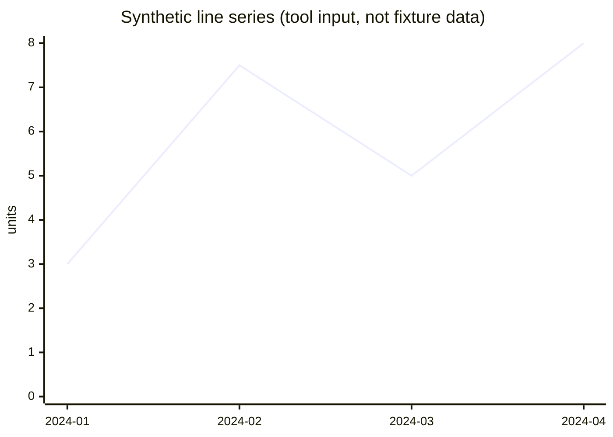
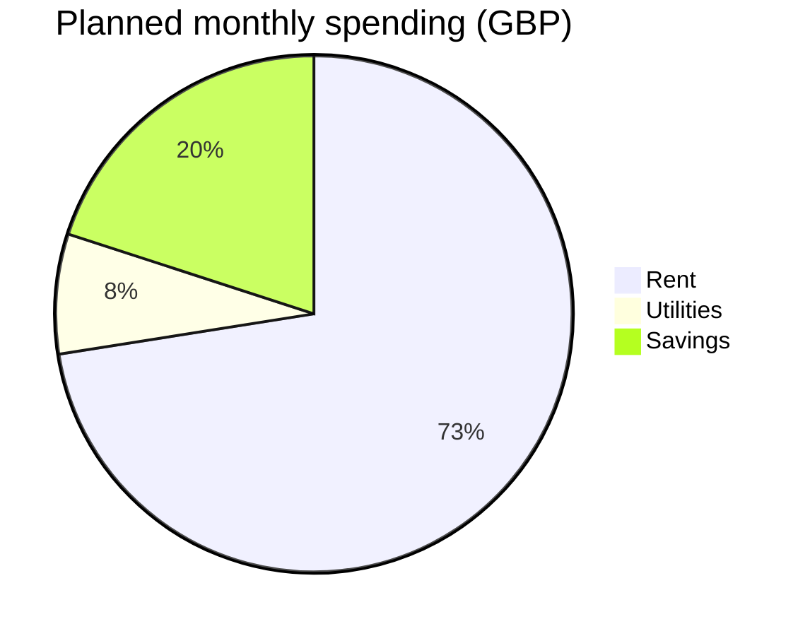
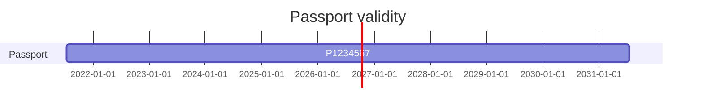
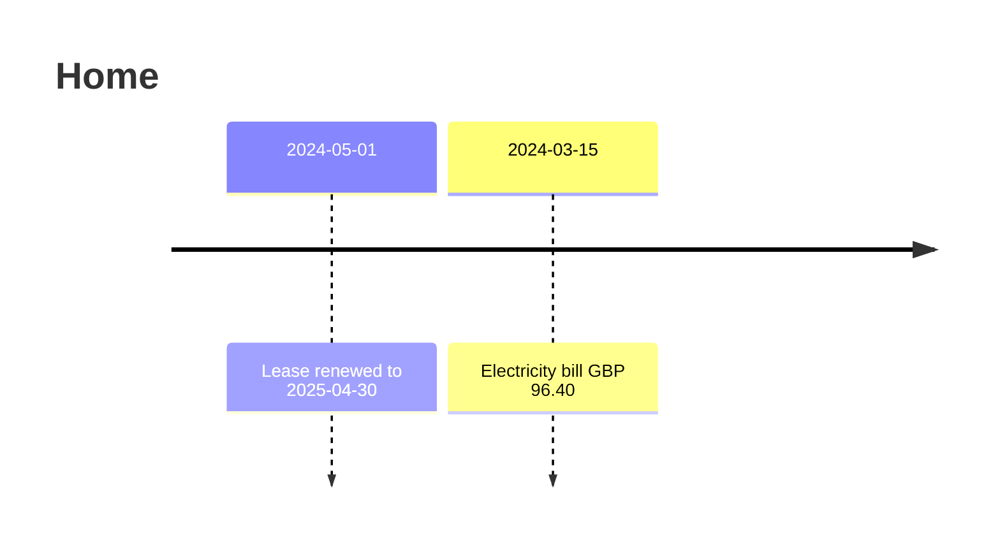

# Render probe

One chart of each kind `wiki.py chart` renders, each followed by its data table, and one callout, its marker alone on its line. Open
this page in each Markdown app the wiki will be read in. For every section, note whether the chart draws, whether
its labels, values and dates read as in the table under it, and anything clipped or misplaced. A kind that does not
draw in every app is taken out of the tool. The page is generated: `tests/test_charts.py --update` rewrites it from
the golden inputs in `tests/golden/charts/`, and a test fails when it differs from the tool's output.

> [!note]
> **Callout.** A box in Obsidian and in Typora. The marker stands alone on its line: Typora prints it as text when
> anything follows it there.

## bar

| Label | Value (GBP) | Source |
| --- | ---: | --- |
| Opening balance | 2410.00 | `02 Finance/Bank statement 2024-03.pdf` |
| Salary in | 3200.00 | `02 Finance/Bank statement 2024-03.pdf` |
| Rent out | 1450.00 | `02 Finance/Bank statement 2024-03.pdf` |
| Closing balance | 4160.00 | `02 Finance/Bank statement 2024-03.pdf` |

## line

| Period | Value (units) | Source |
| --- | ---: | --- |
| 2024-01 | 3 | `02 Finance/Bank statement 2024-03.pdf` |
| 2024-02 | 7.5 | `02 Finance/Bank statement 2024-03.pdf` |
| 2024-03 | 5 | `02 Finance/Bank statement 2024-03.pdf` |
| 2024-04 | 8 | `02 Finance/Bank statement 2024-03.pdf` |

## pie

| Label | Value (GBP) | Source |
| --- | ---: | --- |
| Rent | 1450 | `02 Finance/Tax/Budget final.xlsx` |
| Utilities | 150 | `02 Finance/Tax/Budget final.xlsx` |
| Savings | 400 | `02 Finance/Tax/Budget final.xlsx` |

## gantt

| Section | Label | Start | End | Source |
| --- | --- | --- | --- | --- |
| Passport | P1234567 | 2021-07-15 | 2031-07-15 | `01 Identity/Passport scan.pdf` |

## timeline

| Date | Label | Source |
| --- | --- | --- |
| 2024-05-01 | Lease renewed to 2025-04-30 | `03 Home/Lease renewal.pdf` |
| 2024-03-15 | Electricity bill GBP 96.40 | `03 Home/Utilities /Electricity bill.pdf` |
